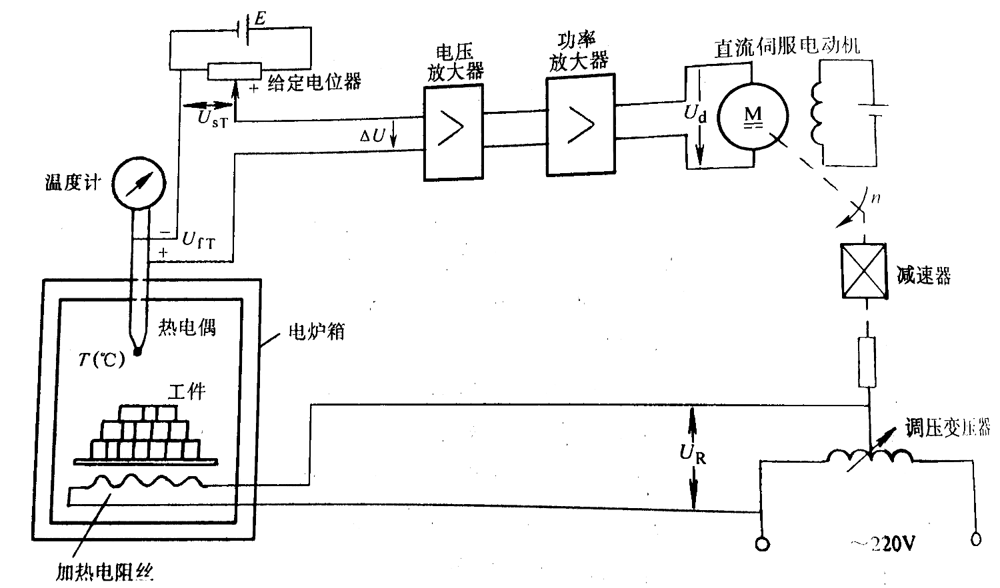

================================
 《自动控制原理》课程作业(2016)
================================

.. contents:: 作业索引
   :local: 

第1章 自动控制原理的基本概念
============================

* 1-1 试列举日常生活中的开环和闭环控制系统，并说明它们的工作原理。

* 1-3 如下图所示的电炉箱恒温自动控制系统。

  (1) 画出系统的框图；
  (2) 说明该系统恒温控制的原理。

第2章 线性系统的数学描述
========================

* 2-2 求下图所示的电子网络的传递函数 :math:`U_c(s)/U_r(s)` 。

  .. image:: figs-hw/ch02-2-enet.png
     :width: 75%			 
     :alt: 电子网络2-2
     :align: center
		  
* 2-3 求下图所示系统的传递函数 :math:`C(s)/D(s)` 和 :math:`E(s)/D(s)` 。

  .. image:: figs-hw/ch02-3-block.png
	 :width: 75%
	 :align: center		
	 :alt: 系统2-3

* 2-4 利用框图简化的等效法则，把图(a)简化为图(b)所示的结构形式。 (1) 求图(b)中的
  :math:`G(s)` 和 :math:`H(s)` ； (2) 求 :math:`C(s)/R(s)` 。

  .. image:: figs-hw/ch02-4-block.png
	 :width: 90%
	 :align: center		
	 :alt: 框图2-4
						 
		
* 2-11 已知系统的信号流图如下，试求系统的闭环传递函数 :math:`C(s)/R(s)` 。

  .. image:: figs-hw/ch02-11-sigflow.png
	 :width: 90%
	 :align: center		
	 :alt: 信号流图2-11

第3章 线性系统的时域分析法
==========================

* 3-5 一控制系统如下图所示。 求系统的阻尼比 :math:`\xi=0.6` 时 :math:`\alpha` 的值和相应的
      :math:`t_p` 、 :math:`t_s` 和超调量 :math:`\sigma` 。

  .. image:: figs-hw/ch03-5-block.png
	 :width: 75%
	 :align: center		
	 :alt: 控制系统3-5
		   
* 3-6 一控制系统如下图所示。若要求系统的超调量 :math:`\sigma=0.25` ，峰值时间
  :math:`t_p=2 \text{sec}` 。 试确定 :math:`K_1` 和 :math:`K_t` 。

  .. image:: figs-hw/ch03-6-block.png
	 :width: 75%
	 :align: center		
	 :alt: 控制系统3-6

* 3-7 一典型二阶系统的单位阶跃响应曲线如下图所示，试求其开环传递函数。

  .. image:: figs-hw/ch03-7-response.png
	 :width: 50%
	 :align: center		
	 :alt: 单位阶跃响应曲线3-7
  
* 3-11 用劳斯稳定判据，判别下图所示系统的稳定性。

  .. image:: figs-hw/ch03-11-block.png
	 :width: 50%
	 :align: center		
	 :alt: 系统的稳定性 3-11

* 3-13 一单位反馈控制系统的开环传递函数为

  .. math::
     G(s) = \frac{10}{s(1+0.1s)}

  (1) 求系统的静态误差系数 :math:`K_p` 、 :math:`K_v` 和 :math:`K_a` ；
  (2) 当输入为 :math:`r(t) = a_0 + a_1 t + 0.5 a_2 t^2` 时，求系统的稳态误差。 
  

* 3-17 已知一复合控制系统如下图所示，其中 :math:`G_1(s) = \frac{K_1}{T_1 s + 1}` ，
  :math:`G_2(s) = \frac{K_2}{s(T_2 s + 1)}` ， :math:`G_3(s) = \frac{K_3}{K_2}` 。 要求在单位阶跃
  扰动作用下，系统的稳态误差 :math:`e_{\mathrm{ss}} = 0` 。试求 :math:`G_0(s)` 。

  .. image:: figs-hw/ch03-17-composite.png
	 :width: 75%
	 :align: center		
	 :alt: 复合控制系统 3-7

* 3-M 编写MATLAB函数，绘制标准二阶系统在不同阻尼比 :math:`\xi` (0, 0.3, 0.7, 0.9, 1.0, 2.0) 下的阶跃响应。
