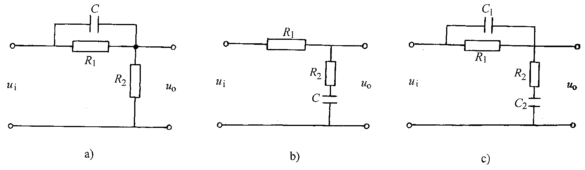
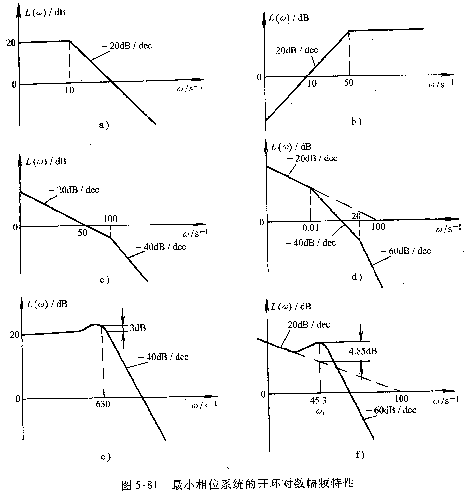
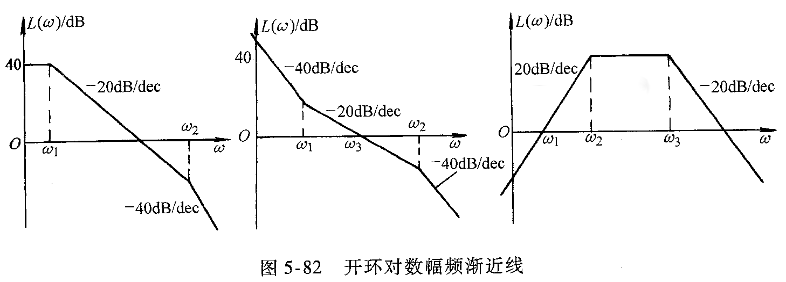

================================
 《自动控制原理》课程作业(2016)
================================

.. contents:: 作业索引
   :local: 

第1章 自动控制原理的基本概念
============================

* 1-1 试列举日常生活中的开环和闭环控制系统，并说明它们的工作原理。

* 1-3 如下图所示的电炉箱恒温自动控制系统。

  (1) 画出系统的框图；
  (2) 说明该系统恒温控制的原理。

.. image:: figs-hw/ch01-3-pot.png
   :width: 90%
   :alt: 电炉箱恒温系统1-3
   :align: center

第2章 线性系统的数学描述
========================

* 2-2 求下图所示的电子网络的传递函数 :math:`U_c(s)/U_r(s)` 。

  .. image:: figs-hw/ch02-2-enet.png
     :width: 75%			 
     :alt: 电子网络2-2
     :align: center
		  
* 2-3 求下图所示系统的传递函数 :math:`C(s)/D(s)` 和 :math:`E(s)/D(s)` 。

  .. image:: figs-hw/ch02-3-block.png
	 :width: 75%
	 :align: center		
	 :alt: 系统2-3

* 2-4 利用框图简化的等效法则，把图(a)简化为图(b)所示的结构形式。 (1) 求图(b)中的
  :math:`G(s)` 和 :math:`H(s)` ； (2) 求 :math:`C(s)/R(s)` 。

  .. image:: figs-hw/ch02-4-block.png
	 :width: 90%
	 :align: center		
	 :alt: 框图2-4
						 
		
* 2-11 已知系统的信号流图如下，试求系统的闭环传递函数 :math:`C(s)/R(s)` 。

  .. image:: figs-hw/ch02-11-sigflow.png
	 :width: 90%
	 :align: center		
	 :alt: 信号流图2-11

第3章 线性系统的时域分析法
==========================

* 3-5 一控制系统如下图所示。 求系统的阻尼比 :math:`\xi=0.6` 时 :math:`\alpha` 的值和相应的
      :math:`t_p` 、 :math:`t_s` 和超调量 :math:`\sigma` 。

  .. image:: figs-hw/ch03-5-block.png
	 :width: 75%
	 :align: center		
	 :alt: 控制系统3-5
		   
* 3-6 一控制系统如下图所示。若要求系统的超调量 :math:`\sigma=0.25` ，峰值时间
  :math:`t_p=2 \text{sec}` 。 试确定 :math:`K_1` 和 :math:`K_t` 。

  .. image:: figs-hw/ch03-6-block.png
	 :width: 75%
	 :align: center		
	 :alt: 控制系统3-6

* 3-7 一典型二阶系统的单位阶跃响应曲线如下图所示，试求其开环传递函数。

  .. image:: figs-hw/ch03-7-response.png
	 :width: 50%
	 :align: center		
	 :alt: 单位阶跃响应曲线3-7
  
* 3-11 用劳斯稳定判据，判别下图所示系统的稳定性。

  .. image:: figs-hw/ch03-11-block.png
	 :width: 50%
	 :align: center		
	 :alt: 系统的稳定性 3-11

* 3-13 一单位反馈控制系统的开环传递函数为

  .. math::
     G(s) = \frac{10}{s(1+0.1s)}

  (1) 求系统的静态误差系数 :math:`K_p` 、 :math:`K_v` 和 :math:`K_a` ；
  (2) 当输入为 :math:`r(t) = a_0 + a_1 t + 0.5 a_2 t^2` 时，求系统的稳态误差。 
  

* 3-17 已知一复合控制系统如下图所示，其中 :math:`G_1(s) = \frac{K_1}{T_1 s + 1}` ，
  :math:`G_2(s) = \frac{K_2}{s(T_2 s + 1)}` ， :math:`G_3(s) = \frac{K_3}{K_2}` 。 要求在单位阶跃
  扰动作用下，系统的稳态误差 :math:`e_{\mathrm{ss}} = 0` 。试求 :math:`G_0(s)` 。

  .. image:: figs-hw/ch03-17-composite.png
	 :width: 75%
	 :align: center		
	 :alt: 复合控制系统 3-7

* 3-M 编写MATLAB函数，绘制标准二阶系统在不同阻尼比 :math:`\xi` (0, 0.3, 0.7, 0.9, 1.0, 2.0) 下的阶跃响应。

第4章 根轨迹法
==============

* 4-5 某单位反馈系统的开环传递函数为 :math:`G(s)=\frac{K_0}{s(s+2)(s+4)}`

  1. 绘制 :math:`K_0` 由 :math:`0 \to \infty` 变化的根轨迹；
  2. 确定系统呈阻尼振荡瞬态响应的 :math:`K_0` 值范围；
  3. 求系统产生持续等幅振荡时的 :math:`K_0` 值和振荡频率；
  4. 求主导复数极点具有阻尼比为 0.5 时的 :math:`K_0` 的值。

* 4-20 设系统的开环传递函数为

  .. math:: G(s)H(s) = \frac{K(s+3)}{(s+4)(s^2 + 2s + 2)}

  试用MATLABy编程，分别画出正、负反馈时系统的根轨迹图，并比较这两个图形有什么不
  同，可得出什么结论。

* 4-22 已知一单位反馈系统的根轨迹如图4-58所示。

  .. image:: figs-hw/fig-4-58.png
     :width: 50%
     :align: center
     :alt: 系统的根轨迹图 4-58	 

  1. 确定系统稳定的开环根轨迹增益 :math:`K` 的取值范围；
  2. 写出系统临界阻尼时的闭环传递函数。 

第5章 频率响应法
================

* 5-1 设一单位反馈控制系统的开环传递函数为

  .. math:: G(s) = \frac{9}{s+1}

  试求系统在下列输入信号作用下的稳态输出。

  1. :math:`r(t) = \sin(t + 30^{\circ})`
  2. :math:`r(t) = 2 \cos (2t - 45^{\circ})`
  3. :math:`r(t) = \sin(t + 30^{\circ}) - 2 \cos (2t - 45^{\circ})`

* 5-4 试求图5-80所示网络的频率特性，并画出它们的对数幅频渐近线。

* 5-5 已知最小相位系统的开环对数幅频特性曲线如图5-81所示，试写出它们的传递函数。

			 
* 5-6 已知三个最小相位系统的开环对数幅频渐近线如图5-82所示。试求：

   1. 写出它们的传递函数；
   2. 粗略地画出各个传递函数所对应的对数相频特性曲线和奈氏图。

* 5-9 绘制下列开环传递函数的奈氏曲线，并用奈氏判据判别系统的稳定性。如果系统不稳
  定，请回答有几个根在 :math:`s` 平面的右方。

  1. :math:`G(s)H(s) = \frac{1+4s}{s^2 (1+s) (1+2s)}`
  2. :math:`G(s)H(s) = \frac{1}{s (1+s) (1+2s)}`
  3. :math:`G(s) = \frac{5}{s (s^2 + 4)}`
  4. 用MATLAB编程，画上述系统的奈氏图，并验证结论。

第6章 控制系统的补偿与综合
==========================

* 6-7 已知某单位反馈的控制系统前向通道的传递函数为
  
  .. math:: G(s) = \frac{K}{s(1+0.1s)(1+s)}

  试设计一超前校正装置，使校正后系统的相位裕量为
  :math:`45^\circ` ，增益裕量不小于 :math:`8 \text{ dB}` ，静态速度误差系数
  :math:`K_v` 不小于 :math:`4.0 \text{ sec}^{-1}` 。
	  

* 6-8 一单位反馈系统，其前向通道的传递函数为

  .. math:: G(s) = \frac{4}{s(1+2s)}

  要求设计一滞后校正装置，使校正后系统的相位裕量为 :math:`40^{\circ}` ，静态速度误差不变。		  

* 6-15 已知一PID控制器如下图所示。试证明其传递函数由下式表示：
	
  .. math::
     G_c(s) = K_p + \frac{K_i}{s} + 	\frac{K_d s}{1 + \alpha s}, \qquad \alpha > 0

第9章 状态空间分析法
====================

* 9-1 已知 R-L-C电路如下图所示。 (1) 试写出以 :math:`i_L` 和 :math:`u_C` 为状态
  变量的状态方程； (2) 已知 :math:`i_L(0) = 0` ， :math:`u_C(0) = 0` ，求单位阶
  跃响应 :math:`u_C(t)` 。

* 9-2 一 R-L-C 电路如下图所示。设状态变量 :math:`x_1 = i_1` ， :math:`x_2 = i_2`
  ， :math:`x_3 = u_C` 。求电路的状态方程。

* 9-4 已知一系统的传递函数为

  .. math:: G(s) = 	\frac{s^2 + 6 + 8}{s^2 + 4s + 3}

  试写出该系统的能控标准形、能观标准形和对角标准形实现。		  

* 9-5 已知某系统的传递函数为

  .. math:: G(s) = \frac{8(s+5)}{s^3 + 12s^2 + 44s + 48}

  试求： (1) 能控标准形实现； (2) 对角标准形实现。
		  
* 9-10 已知控制系统的状态方程为

  .. math:: \dot{\mathbf{x}} = \mathbf{A} \mathbf{x}

  其中

  .. math:: \mathbf{A} = \begin{bmatrix} 0 & 6 \\ -1 & -5 \end{bmatrix}

  求： (1) 系统特征方程式的根； (2) 状态转移矩阵。

* 9-11 已知控制系统的状态方程为

  .. math:: \dot{\mathbf{x}} = \mathbf{A} \mathbf{x}

  其中

  .. math:: \mathbf{A} = \begin{bmatrix} 0 & 1 \\ 0 & 0 \end{bmatrix}

  (1) 求状态转移矩阵 :math:`\mathbf{\Phi}(t)` ；
  (2) 若实始状态变量为 :math:`x_1(0) = x_2(0) = 1` ，求 :math:`\mathbf{x}(t)` 。	
	
* 9-16 已知某控制系统的动态方程为

  .. math::
    \begin{split} \dot{\mathbf{x}} &= \begin{bmatrix} -2 & 2 & 1 \\
      0 & -2 & 0 \\ 1 & -4 & 0 \end{bmatrix} \mathbf{x} +
	  \begin{bmatrix} 0 \\ 1 \\ 1 \end{bmatrix} u \\
      y &= \begin{bmatrix} 1 & 0 & 0 \end{bmatrix} \mathbf{x} 
    \end{split}

  (1) 判别该系统的能控性和能观性；
  (2) 求系统的传递函数。	
