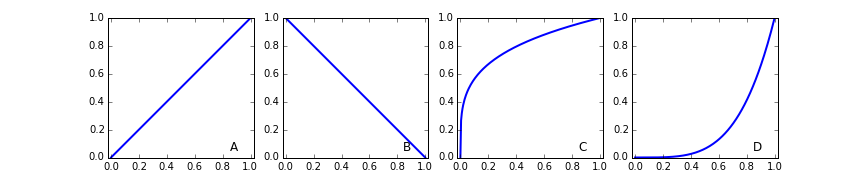
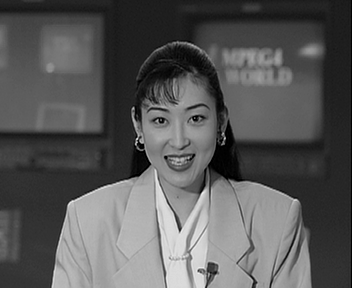

《图像处理与成像制导》作业(2016-01)
===================================

提交作业相关信息
----------------

- 提交作业截止时间：2016年4月11日 23:59:59
- 作业提交方式： 发送电子邮件至 fred DOT qi AT ieee DOT org
- 电子邮件标题格式为 [IMGNAV] HW1601 - 你的学号 - 姓名

1. 傅里叶变换
-------------

试根据傅里叶变换公式

   .. math:: 
	  H(\omega_1, \omega_2) = \sum_{n_1 = -\infty}^{\infty} \sum_{n_1 =
	  -\infty}^{\infty} h(n_1, n_2) \exp(-j\omega_1 n_1) \exp(-j \omega_2 n_2)

计算卷积核

   .. math::
	  h=\frac{1}{9} \begin{bmatrix} 1 & 1 & 1 \\ 1 & 1 & 1 \\ 1 & 1 & 1 \end{bmatrix}

的傅里叶变换（解析）公式，并尝试使用 ``matplotlib`` 绘制该卷积核的频域图像。

2. 灰度变换
-----------

一幅图像分别经过下列的灰度变换，经过哪个变换后所得到的图像看起来比原来的图像更明亮？

|灰度变换|

3. 图像的存储空间
-----------------

一幅图像大小为512x512，图像为8比特灰度图像，试计算该存储该图像（不考虑压缩）
需要多少内存空间？如果图像为3通道的彩色图像，所需要的存储空间又是多少？

可以使用下述代码验证你的答案是否正确

.. code:: python

    import numpy as np
    img = np.zeros((512, 512), dtype=np.byte)
    print img.shape, img.size
    img = np.zeros((512, 512, 3), dtype=np.byte)
    print img.shape, img.size

4. 图像的直方图
---------------

试补写以下程序，生成有32个分量的直方图。我们默认输入图像类型为 ``np.ubyte`` 。为
方便你编写程序，这里提供了两种计算直方图的实现框架。

.. code:: python

    def histogram_naive_loop(img, bins=32):
        """使用简单循环计算图像的直方图"""
        assert img.dtype == np.ubyte
        delta = 256 // bins
        n_rows, n_cols = img.shape
        hist = np.zeros((bins, ), dtype=np.int)
        for row in range(n_rows):
            for col in range(n_cols):
                # 请补全代码，完成后删除下面一行
                pass
        return hist
        

    def histogram_bin_loop(img, bins=32):
        """使用简单循环计算图像的直方图"""
        assert img.dtype == np.ubyte
        delta = 256 // 32
        bin_index = img // delta
        hist = np.zeros((bins, ), dtype=np.int)
        for b in range(bins):
            # 请补全代码，完成后删除下面一行
            pass
        return hist

可以使用下列代码验证你的程序是否正确

.. code:: python

    import numpy as np
    from scipy.ndimage import histogram
    import matplotlib.pyplot as plt

    # 设置参数，请尝试修改 n_bins
    n_bins = 32
    delta = 256 // n_bins
    bin_pos = [delta*b for b in range(n_bins)]

    # 生成图像
    img = np.random.randint(0, 255, size=(256, 256))
    img = np.array(img, dtype=np.ubyte)

    # 计算参考直方图
    hist_scipy = histogram(img, 0, 255, n_bins)
    # 计算直方图
    hist_naive = histogram_naive_loop(img, bins=n_bins)
    hist_bin = histogram_bin_loop(img, bins=n_bins)

    # 绘制图像进行比较
    plt.figure()
    plt.plot(bin_pos, hist_scipy, 'm', lw=3, label='scipy')
    plt.plot(bin_pos, hist_naive, 'r--', lw=2, label='Naive Loop')
    plt.plot(bin_pos, hist_bin, 'b:', lw=3, label='bin Loop')
    plt.xlim(0, 256+150)
    plt.xticks([n_bins*t for t in range(delta+1)])
    plt.legend()
    plt.show()

在 ``ipython notebook`` 中可以使用下述代码比较两种直方图计算函数的计算速度。

.. code:: python

    img = np.random.randint(0, 255, size=(512, 512))
    img = np.array(img, dtype=np.ubyte)
    %timeit histogram(img, 0, 255, 32)
    %timeit histogram_naive_loop(img)
    %timeit histogram_bin_loop(img)

请完成以下练习。

1) 请下载直方图程序并补全，实现直方图的计算。
2) 请下载绘制直方图程序，验证你的实现方案是否正确。
3) 评估不同实现方案的计算效率。

5. 图像增强
-----------

尝试编写图像增强（去噪的程序）并使用量化的评估方法评价结果。

|图像增强|

两幅图像之间的差异可以使用均方误差(Mean Squared Error, MSE)与峰值信噪比(Peak
Signal-to-Noise Ratio, PSNR)进行定量化的分析。记大小均为 :math:`N_1 \times N_2`
的两幅图像 :math:`f(n_1, n_2)` 与 :math:`g(n_1, n_2)` 。则均方误差可以使用下式计
算。

.. math::

   \textrm{MSE} = \sum_{n_1=0}^{N_1-1} \sum_{n_2=0}^{N_2-1}
   [ f(n_1, n_2) - g(n_1, n_2)]^2 

而峰值信噪比的计算式为

.. math::

   \textrm{PSNR} = 10 \log_{10} \left( \frac{\textrm{MAX}_{I}^2}{MSE} \right)

其中 :math:`\textrm{MAX}_I` 为图像中像素灰度可以取得的最大值。

请根据以下指引完成本项练习。

  #. 下载 :download:`图像 <HW1601_figs/akiyo-gray.png>`
  #. 读入图像，将图像数据转化为浮点数形式
  #. 使用 ``numpy`` 建立一个 3x3的低通滤波器，即创建个 3x3 的 ``ndarray`` ，每个
	 元素均为 1.0/9。
  #. 对图像进行低通滤波。可以使用 ``scipy.ndimage.filters.convolve`` 函数。该函数
     首个输入参数为待滤波的图像，第二个输入参数为卷积核，即上一步中创建的卷积核。
     其他参数为关键字参数。比较重要的参数是 ``mode`` ，用于指定进行滤波处理时对原
     始图像处理所采用的边界条件。可选的边界条件包括 ``reflect``, ``constant``,
     ``nearest``, ``mirror``, ``wrap`` 。
  #. 计算并记录滤波后图像相对于原始图像的 PSNR 。 
  #. 使用 :math:`5 \times 5` 的低通滤波器（滤波器系数为1.0/25）重复前面的步骤1-5。计算PSNR 
  #. [可选] 尝试自己实现空域低通滤波，并分析算法的运行时间。

