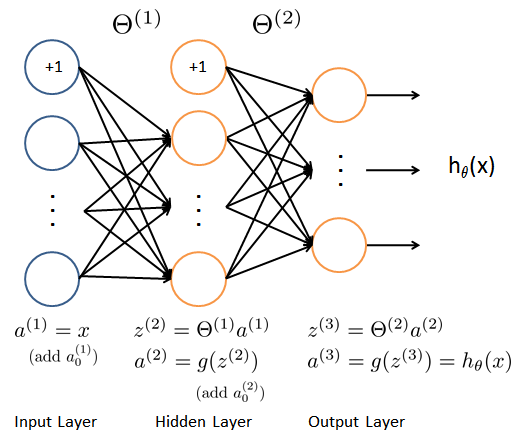

===============================
《模式识别与应用》作业(2016-03)
===============================

作业提交信息
============

- 提交作业截止时间： 2016/11/22 23:59:59 (CST)
- 发送电子邮件至 fred DOT qi AT ieee DOT org
- 邮件标题格式： [PRML] HW1603-学号-姓名
- 请勿删除作业所提供代码中的注释，将你的代码放入添加代码标志中间。

作业提交内容
------------

-  完善后的程序代码
-  书面报告

作业相关文件
------------

-  :download:`PRML_Neural_Networks.py <HW1603_files/PRML_Neural_Networks.py>`
-  :download:`ex3data.mat <HW1603_files/ex3data.mat>`
-  :download:`ex3weights.mat <HW1603_files/ex3weights.mat>`

使用神经网络进行机器学习
========================

在本项练习中，你将学会如何实现神经网络的误差反传训练算法，并应用它进行手写数字识别。

神经网络
--------

数据可视化
~~~~~~~~~~

本次练习所用的数据集有5000个训练样本，每个样本对应于20x20大小的灰度图像。这些训
练样本包括了9-0共十个数字的手写图像。这些样本中每个像素都用浮点数表示。加载得到
的数据中，每幅图像都被展开为一个400维的向量，构成了数据矩阵中的一行。完整的训练
数据是一个5000x400的矩阵，其每一行为一个训练样本（数字的手写图像）。数据中，对应
于数字"0"的图像被标记为"10"，而数字"1"到"9"按照其自然顺序被分别标记为"1"到"9"。

.. math::

    X = \begin{bmatrix} - & (\mathbf{x}^{(1)})^T & - \\
                          - & (\mathbf{x}^{(2)})^T & - \\
                              &  \vdots &  \\
                          - & (\mathbf{x}^{(m)})^T & - \end{bmatrix}

程序的第一部分将加载数据并将其显示为如下图所示的形式。实现这一功能需要你补充完善
函数 ``display_data`` 。

模型表示
~~~~~~~~

我们准备训练的神经网络是一个三层的结构，一个输入层，一个隐层以及一个输出层。由于
我们训练样本（图像）是20x20的，所以输入层单元数为400（不考虑额外的偏置项，如果考
虑单元个数需要+1）。在我们的程序中，数据会被加载到变量 :math:`X` 和 :math:`y` 里。

本项练习提供了一组训练好的网络参数( :math:`\Theta^{(1)}`, :math:`\Theta^{(2)}`
）。这些数据存储在数据文件 ``ex3weights.mat`` ，在程序中被加载到变量 ``Theta1``
与 ``Theta2`` 中。参数的维度对应于第二层有25个单元、10个输出单元（对应于10个数字
的类别）的网络。

前向传播与代价函数
~~~~~~~~~~~~~~~~~~

现在你需要实现神经网络的代价函数及其梯度。首先需要使得函数
``nn_cost_function`` 能够返回正确的代价值。

神经网络的代价函数（不包括正则化项）的定义为：

.. math::

    J(\theta) = \frac{1}{m} \sum_{i=1}^{m} \sum_{k=1}^{K} \left[
   -y_k^{(i)} \log((h_{\theta}(x^{(i)}))_k) 
   -(1 - y_k^{(i)}) \log(1 - (h_{\theta}(x^{(i)}))_k) 
   \right] 

其中 :math:`h_{\theta}(x^{(i)})` 的计算如神经网络结构图所示， :math:`K=10` 是
所有可能的类别数。这里的 :math:`y` 使用了one-hot 的表达方式。

运行程序，使用预先训练好的网络参数，确认你得到的代价函数是正确的。（正确的代价约为0.287629）。

代价函数的正则化
~~~~~~~~~~~~~~~~

神经网络包括正则化项的代价函数为

.. math::
   
   \begin{split}
   J(\theta) =& \frac{1}{m} \sum_{i=1}^{m} \sum_{k=1}^{K} \left[
   -y_k^{(i)} \log((h_{\theta}(x^{(i)}))_k) 
   -(1 - y_k^{(i)}) \log(1 - (h_{\theta}(x^{(i)}))_k) 
   \right] \\ &+ \frac{\lambda}{m} \left[ 
   \sum_{j=1}^{25} \sum_{k=1}^{400} (\Theta_{j,k}^{(1)})^2 +
   \sum_{j=1}^{10} \sum_{k=1}^{25} (\Theta_{j,k}^{(2)})^2 \right]
   \end{split}

注意在上面式子中，正则化项的加和形式与练习中设定的网络结构一致。但是你的代码实现
要保证能够用于任意大小的神经网络。

此外，还需要注意，对应于偏置项的参数不能包括在正则化项中。对于矩阵 ``Theta1`` 与
``Theta2`` 而言，这些项对应于矩阵的第一列。

运行程序，使用预先训练好的权重数据，设置正则化系数 :math:`\lambda=1` (``lmb``)
确认你得到的代价函数是正确的。（正确的代价约为0.383770）。

此步练习需要你补充实现 ``nn_cost_function`` 。

误差反传训练算法
----------------

``Sigmoid`` 函数及其梯度
~~~~~~~~~~~~~~~~~~~~~~~~

Sigmoid 函数定义为

.. math::  \text{sigmoid}(z) = g(z) = \frac{1}{1+\exp(-z)}

Sigmoid 函数的梯度可以按照下式进行计算

.. math::  g^{\prime}(z) = \frac{d}{dz} g(z) = g(z)(1-g(z)) 

为验证你的实现是正确的，以下事实可供你参考。当 :math:`z=0` 是，梯度的精确值为
0.25 。当 :math:`z` 的值很大（可正可负）时，梯度值接近于0。

这里，你需要补充完成函数 ``sigmoid`` 与 ``sigmoid_gradient`` 。
你需要保证实现的函数的输入参数可以为矢量和矩阵( ``numpy.ndarray``)。

网络参数的随机初始化
~~~~~~~~~~~~~~~~~~~~

训练神经网络时，使用随机数初始化网络参数非常重要。一个非常有效的随机初始化策略为，在范围
:math:`[ -\epsilon_{init}, \epsilon_{init} ]` 内按照均匀分布随机选择参数
:math:`\Theta^{(l)}` 的初始值。这里你需要设置
:math:`\epsilon_{init} = 0.12` 。这个范围保证了参数较小且训练过程高效。

你需要补充实现函数 ``rand_initialize_weigths`` 。

对于一般的神经网络，如果第 :math:`l` 层的输入单元数为
:math:`L_{in}` ，输出单元数为 :math:`L_{out}` ，则
:math:`\epsilon_{init} = \frac{\sqrt{6}}{\sqrt{L_{in} + L_{out}}}`
可以做为有效的指导策略。

误差反传训练算法 (Backpropagation)
~~~~~~~~~~~~~~~~~~~~~~~~~~~~~~~~~~

.. image:: HW1603_files/nn-backpropagation.png
		
现在你需要实现误差反传训练算法。误差反传算法的思想大致可以描述如下。对于一个训练
样本:math:`(x^{(t)}, y^{(t)})` ，我们首先使用前向传播计算网络中所有单元（神经元）
的激活值（activation），包括假设输出 :math:`h_{\Theta}(x)` 。那么，对于第
:math:`l` 层的第 :math:`j` 个节点，我们期望计算出一个“误差项”
:math:`\delta_{j}^{(l)}` 用于衡量该节点对于输出的误差的“贡献”。

对于输出节点，我们可以直接计算网络的激活值与真实目标值之间的误差。对于我们所训练的第3层为输出层的网络，这个误差定义了
:math:`\delta_{j}^{(3)}` 。对于隐层单元，需要根据第 :math:`l+1`
层的节点的误差的加权平均来计算 :math:`\delta_{j}^{(l)}` 。

下面是误差反传训练算法的细节（如图3所示）。你需要在一个循环中实现步骤1至4。循环的每一步处理一个训练样本。第5步将累积的梯度除以
:math:`m` 以得到神经网络代价函数的梯度。

1. 设输入层的值( :math:`a^{(1)}`)为第 :math:`t` 个训练样本
   :math:`x^{(t)}`
   。执行前向传播，计算第2层与第3层各节点的激活值( :math:`z^{(2)}`,
   :math:`a^{(2)}`, :math:`z^{(3)}`, :math:`a^{(3)}`)。注意你需要在
   :math:`a^{(1)}` 与 :math:`a^{(2)}` 增加一个全部为 +1
   的向量，以确保包括了偏置项。在 ``numpy`` 中可以使用函数 ``ones`` ，
   ``hstack``, ``vstack`` 等完成（向量化版本）。

2. 对第3层中的每个输出单元 :math:`k` ，计算

   .. math::  \delta_{k}^{(3)} = a_{k}^{(3)} - y_k 

   其中 :math:`y_k \in \{0, 1\}` 表示当前训练样本是否是第 :math:`k` 类。

3. 对隐层 :math:`l=2` , 计算

   .. math::  \delta^{(2)} = \left( \Theta^{(2)} \right)^T \delta^{(3)} .* g^{\prime} (z^{(2)}) 

   其中 :math:`g^{\prime}` 表示 Sigmoid 函数的梯度， ``.*`` 在 ``numpy`` 中是通
   常的逐个元素相乘的乘法，矩阵乘法应当使用 ``numpy.dot`` 函数。

4. 使用下式将当前样本梯度进行累加：

   .. math::  \Delta^{(l)} = \Delta^{(l)} + \delta^{(l+1)}(a^{(l)})^T 

   在 ``numpy`` 中，数组可以使用 ``+=`` 运算。

5. 计算神经网络代价函数的（未正则化的）梯度，

   .. math::  \frac{\partial}{\partial \Theta_{ij}^{(l)}} J(\Theta) = D_{ij}^{(l)} = \frac{1}{m} \Delta_{ij}^{(l)} 

这里，你需要（部分）完成函数 ``nn_grad_function`` 。程序将使用函数
``check_nn_gradients`` 来检查你的实现是否正确。

在使用循环的方式完成函数 ``nn_grad_function``
后，建议尝试使用向量化的方式重新实现这个函数。

检查梯度
~~~~~~~~

在神经网络中，需要最小化代价函数 :math:`J(\Theta)`
。为了检查梯度计算是否正确，考虑把参数 :math:`\Theta^{(1)}` 和
:math:`\Theta^{(2)}` 展开为一个长的向量 :math:`\theta` 。假设函数
:math:`f_i(\theta)` 表示
:math:`\frac{\partial}{\partial \theta_i} J(\theta)` 。

令

.. math:: \theta^{(i+)} = \theta + \begin{bmatrix} 0 \\ 0 \\ \vdots \\ \epsilon \\ \vdots \\ 0 \end{bmatrix} \qquad \theta^{(i-)} = \theta - \begin{bmatrix} 0 \\ 0 \\ \vdots \\ \epsilon \\ \vdots \\ 0 \end{bmatrix} 

上式中， :math:`\theta^{(i+)}` 除了第 :math:`i` 个元素增加了 :math:`\epsilon` 之
外，其他元素均与 :math:`\theta` 相同。类似的， :math:`\theta^{(i-)}` 中仅第
:math:`i` 个元素减少了 :math:`\epsilon` 。可以使用数值近似验证
:math:`f_i(\theta)` 计算是否正确：

.. math::  f_i(\theta) \approx \frac{J(\theta^{(i+)}) - J(\theta^{(i-)})}{2\epsilon} 

如果设 :math:`\epsilon=10^{-4}` ，通常上式左右两端的差异出现于第4位有效数字之后
（经常会有更高的精度）。

在练习的程序代码中，函数 ``compute_numerical_gradient``
已经实现，建议你认真阅读该函数并理解其实现原理与方案。

之后，程序将执行 ``check_nn_gradients`` 函数。该函数将创建一个较小的神经网络用于
检测你的误差反传训练算法所计算得到的梯度是否正确。如果你的实现是正确的，你得到的
梯度与数值梯度之后的绝对误差（各分量的绝对值差之和）应当小于 :math:`10^{-9}` 。

神经网络的正则化
~~~~~~~~~~~~~~~~

你正确实现了误差反传训练算法之后，应当在梯度中加入正则化项。

假设你在误差反传算法中计算了
:math:`\Delta_{ij}^{(l)}` ，你需要增加的正则化项为

.. math::  \frac{\partial}{\partial \Theta_{ij}^{(l)}} J(\Theta) = D_{ij}^{(l)} = \frac{1}{m} \Delta_{ij}^{(l)} \qquad \text{for } j = 0

.. math::  \frac{\partial}{\partial \Theta_{ij}^{(l)}} J(\Theta) = D_{ij}^{(l)} = \frac{1}{m} \Delta_{ij}^{(l)} + \frac{\lambda}{m} \Theta_{ij}^{(l)} \qquad \text{for } j \geq 1

注意你不应该正则化 :math:`\Theta^{(l)}` 的第一列，因其对应于偏置项。

此步练习需要你补充实现函数 ``nn_grad_function`` 。

使用 ``fmin_cg`` 学习网络参数
~~~~~~~~~~~~~~~~~~~~~~~~~~~~~

如果你正确实现了神经网络的代价函数与梯度计算函数，下一步就是使用
``scipy.optimize.fmin_cg`` 函数学习一组较好的网络参数。

在训练完成后，程序会汇报在训练集上的正确率。如果你的实现正确，得到的正确率应该在
95.4% 左右（由于随机初始化的原因可能有 1% 变化）。

你可以调整正则化参数 :math:`\lambda` (``lmb``)
以及优化算法的最大迭代次数（如设 ``maxiter = 400`` ），来观察各参数对训练过程和结果的影响。

可视化隐层
----------

理解神经网络学到什么的一种途径是将隐层单元学到的表示进行可视化。非正式的说，对一个特定的隐层单元，一种可视化其计算结果的方式是找到一个能够使其激活（即其activation
value (:math:`a_{i}^{(l)}` 接近于1）输入 :math:`\mathbf{x}` 。

对于我们学得的神经网络，一种可视化其隐层所学得的“表示”的方式是将除偏置单元外的
400 维向量转换为 20x20 的图像并显示出来。
